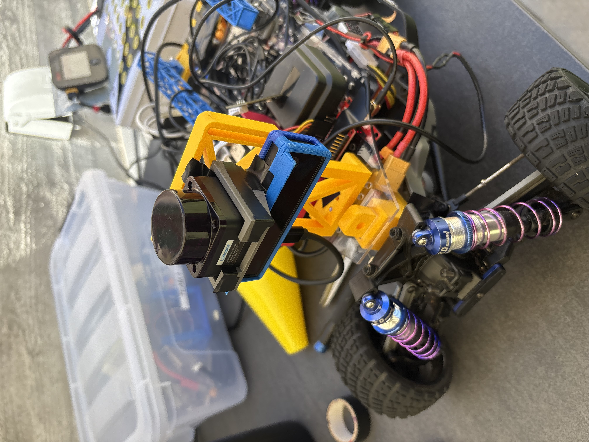
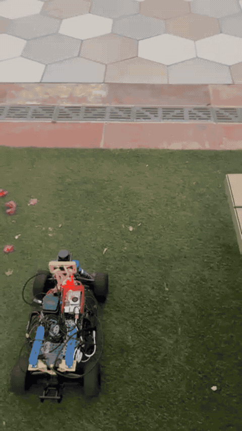
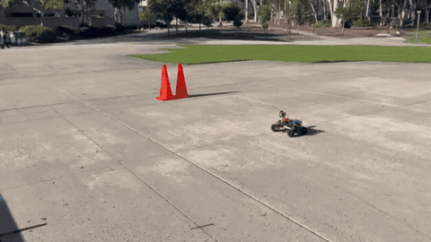

<p align="center">
  
</p>

<h1 align="center">MANTA(ray)</h1>

<p align="center">
  <b>A Multi-Sensor Autonomous Navigation & Transit Architecture</b>
</p>

<p align="center">
  <b>UC San Diego MAE/ECE 148 — Summer Session II 2026 — Team 1</b>
</p>

<p align="center">
  GPS-IMU Sensor Fusion RoboCar with Object Identification for Obstacle Avoidance
</p>

<p align="center">
  <b>Austin — MAE &nbsp;&nbsp; | &nbsp;&nbsp; Luis — MAE</b>
</p>

---

## Demonstration

### Two-Cone Guidance

<table>
  <tr>
    <td align="center"><b>Successful Two-Cone Guidance</b></td>
    <td align="center"><b>Integrated Stack Failure Case</b></td>
  </tr>
  <tr>
    <td align="center">
      
    </td>
    <td align="center">
      
    </td>
  </tr>
  <tr>
    <td align="center">
      <sub>IMG_8104 — MANTA(ray) successfully performing the two-cone guidance maneuver.</sub>
    </td>
    <td align="center">
      <sub>IMG_8126 — the integrated stack failing to reliably complete the same two-cone guidance maneuver.</sub>
    </td>
  </tr>
</table>

### Original Video Files

- [Successful two-cone guidance — IMG_8104.mov](media/IMG_8104.mov)
- [Integrated-stack failure — IMG_8126.mov](media/IMG_8126.mov)

---
## Project Goals and Final Status

### Must-Haves

| Goal | Final Status |
|---|---|
| GPS-IMU Sensor Fusion | Achieved |
| Autonomous Point-to-Point Navigation | Achieved in semi-autonomous form |
| OAK-D Lite YOLO Object Identification | Achieved |
| OAK-D Lite Depth Calibration | Achieved |
| Obstacle Avoidance Software | Implemented and partially integrated |

### Reach Goals

| Goal | Final Status |
|---|---|
| LiDAR Detection Emergency Stop | Incorporated into the obstacle-detection stack with OAK-D |
| Multiple selectable pickup and destination locations | Not completed |
| Simple taxi-request interface | Not completed |
| Automatic continuation after an obstacle is removed | Achieved |
| Vehicle-speed-dependent LiDAR stopping distances | Not completed |
| Improved route following / path-following controller | Not completed |
| Dynamic obstacle avoidance rather than emergency stopping only | Not completed |
| Visualization / logging of GPS, IMU, and fused trajectories | Not completed |

---

## What Worked

### GPS-IMU Sensor Fusion

The GPS-IMU fusion stack successfully combined GPS and IMU data for vehicle localization.

Key results:
- Maintained a constant output rate of approximately **100 Hz**
- Achieved approximately **2-4 m localization accuracy**
- Successfully integrated the IMU into the vehicle stack

ROS 2 package:

`src/manta_localization/`

### Semi-Autonomous Point-to-Point Navigation

The waypoint-navigation stack successfully accepted GPS targets and generated movement commands through the safety chain.

Key result:
- Navigation commands were successfully passed through the **MANTA safety gate** and used to move the RoboCar

ROS 2 package:

`src/manta_waypoint_navigation/`

### OAK-D Lite Perception

The OAK-D Lite successfully produced YOLO-based cone detections and normal cone bounding boxes.

The perception stack was used as the basis for the two-cone visual-guidance and obstacle-avoidance experiments.

### LiDAR and Safety Integration

The LD06 LiDAR was successfully integrated into the MANTA system.

The LiDAR emergency-stop capability was incorporated into the obstacle-detection stack alongside OAK-D perception.

---

## Partial vs. Full Integration

The project achieved **partial system integration** and demonstrated the major subsystems working individually and in partial combinations.

However, the team did **not complete a stable full-stack demonstration** in which GPS waypoint navigation, perception, visual obstacle avoidance, command arbitration, and safety all transitioned reliably during live motion.

This distinction is important: the principal challenge was not basic sensor bring-up, but robust subsystem handoff and full-stack integration.

---

## What Did Not Work as Expected

Observed integration problems included:

- Two-cone lane-guidance handoff was not reliable under live motion
- The camera wrapper could keep the OAK-D device locked after restart
- LiDAR health could flicker under integration load
- Navigation errors accumulated during live integration testing
- Several components were difficult to stabilize mechanically and in software

---

## Root Cause of the Integration Issues

Most individual components worked, but the integrated system depended on reliable handoffs between:

1. Perception
2. Obstacle avoidance
3. Waypoint navigation
4. Safety gate

During live testing, duplicate publishers and inconsistent state transitions could cause:
- the RoboCar to stop unexpectedly
- unstable steering
- unreliable switching between navigation and avoidance behavior

A major lesson from the project was that **subsystem functionality does not automatically imply reliable system-level autonomy**.

---

## How We Would Solve the Issues

### Software Architecture

The preferred next architecture would use one explicit state machine:

`GPS + Gate Approach + Visual Servo + Clearance + GPS`

The system should also:

- Guarantee exactly one active publisher for waypoint-navigation motion commands
- Use explicit command arbitration
- Add watchdogs that report stale topics without unexpectedly changing navigation state

### Testing Process

Future testing should:

- Run perception-only tests before any motion testing
- Use `rosbag` replay for repeatable cone scenarios
- Tune steering direction and gain with the wheels lifted before floor testing
- Validate each state transition independently before running the full stack

---

## If We Had Another Week

The highest-priority work would be:

1. Finish mechanical beautification and hardware cleanup
2. Perform extensive ROS 2 full-stack integration debugging
3. Improve LiDAR and OAK-D mounting stability and reduce sensor flimsiness
4. Consolidate the navigation and avoidance stack around one explicit state machine
5. Conduct repeated end-to-end regression tests

---

## Development Plan / Gantt Chart

The project was organized around three primary technical areas:

1. **GPS-IMU Sensor Fusion & Localization**
   - GPS and IMU data integration / calibration
   - Sensor-fusion algorithm development and tuning
   - Localization and point-to-point testing

2. **YOLO Obstacle Detection Model**
   - OAK-D camera model training and integration
   - Obstacle detection and emergency-stop logic
   - Braking and safety validation

3. **Taxi System Integration & Validation**
   - Taxi-state logic and point-to-point integration
   - Full-system testing and demonstration

Documentation, data analysis, and the final presentation were developed in parallel.

---

## System Overview

```text
GPS ───────────────┐
                   ├──> GPS-IMU Fusion ──> Fused Localization
BNO085 IMU ────────┘                           │
                                              v
                                     Waypoint Navigation
                                              │
                                              v
                                      Command Arbitration
                                              │
OAK-D Lite ──> YOLO Detection ──> Avoidance ─┤
                                              │
LD06 LiDAR ───────────────────────────────────> Safety Gate
                                              │
                                              v
                                      VESC / RoboCar

```

The safety gate remains downstream of navigation and avoidance commands so that safety logic retains final authority over vehicle motion.

---

## Repository Structure

```text

├── src/
│   ├── manta_localization/
│   │   └── GPS-IMU sensor-fusion ROS 2 package
│   │
│   └── manta_waypoint_navigation/
│       └── GPS waypoint-navigation ROS 2 package
│
├── runtime/
│   └── MANTA startup, arming, status, logging, and orchestration tools
│
├── experimental/
│   └── Experimental cone-guidance, arbitration, and integration utilities
│
├── docs/
│   ├── architecture.md
│   └── system_breakdown.md
│
├── media/
│   └── Images, diagrams, and demonstration media
│
└── presentation/
    └── Final project presentation
```

---

## Experimental Code

The files under `experimental/` preserve integration approaches explored during final development, including:

- two-cone visual guidance
- direct OAK-D detection
- command arbitration
- avoidance-state management
- navigation handoff experiments

These files document the engineering process and should **not automatically be treated as the final validated runtime configuration**.

---

## External Dependencies

MANTA(ray) was built on top of the UCSD RoboCar ROS 2 platform.

Major external dependencies include:

- ROS 2 Jazzy
- UCSD RoboCar ROS 2 packages
- `bno08x-ros2-driver`
- `nmea_navsat_driver`
- DepthAI / OAK-D Lite support
- LD06 LiDAR ROS 2 support
- VESC actuator interface

The repository intentionally separates Team 1 project code from the complete UCSD course framework and third-party sensor drivers.

---

## Final Presentation

See the final Team 1 presentation in:

`presentation/MANTA_Final_Presentation.pdf`

---

## Acknowledgements

Thank you to **Professor Silberman, Daniel, and Jose** for helping us throughout the last five weeks. We greatly appreciate their guidance, support, and assistance throughout the development and integration of MANTA(ray).

## Course

**UCSD MAE/ECE 148 Introduction to Autonomous Vehicles**  
**Summer Session II 2026**  
**Team 1**

